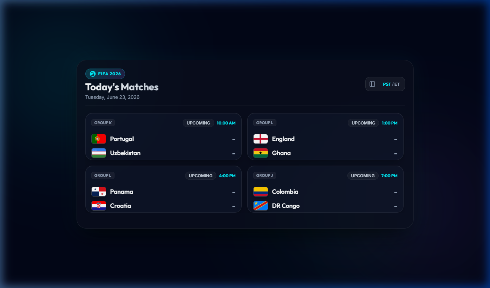

# FIFA World Cup 2026 - Today's Matches Widget

A premium, glassmorphic Windows desktop widget built with Electron to track today's FIFA 2026 World Cup matches in real-time.



## Features

- **Glassmorphism UI**: High-end visual aesthetics with vibrant colors, card glow effects, and dynamic backdrop blur.
- **Dual Layout Modes**: Instantly toggle between **Horizontal** (`960x480`) and **Vertical** (`480x800`) alignments to fit your desktop.
- **Live Match Simulation**: Real-time state updates matching the system clock:
  - **Upcoming**: Pre-match info and kickoff timers.
  - **Live**: Live scoreboard updates, match timers (e.g., `45'`, `HT`, `88'`), and stats tracking.
  - **Finished (FT)**: Final match scores.
- **Interactive Match Details Modal**: Click any match card to view:
  - **Match Stats**: Live possession, shot count, shots on target, fouls, and corners.
  - **Lineups**: Full 11-player squad lineups for both teams.
  - **Match Timeline**: Detailed event feed showing goals, assists, yellow cards, red cards, and substitutions.
- **Confetti Goal Alerts**: Live overlay popups with CSS confetti animations whenever a goal is scored.
- **Timezone Toggle**: Swiftly switch kickoff times between **PST** and **ET**.
- **Keyboard Accessible**: Fully interactive and navigable via keyboard inputs.

## Technology Stack

- **Shell Framework**: Electron (v29)
- **Frontend**: Vanilla HTML5, CSS3 (Custom Variables, Flexbox/Grid, Animations), and Modern JavaScript

## Getting Started

### Prerequisites

Ensure you have [Node.js](https://nodejs.org/) installed.

### Installation

1. Clone this repository or open the project folder in your terminal.
2. Install the dependencies:
   ```bash
   npm install
   ```

### Running the Application

To start the desktop widget:

#### On Command Prompt (cmd) / macOS / Linux:
```bash
npm start
```

#### On Windows PowerShell (if script execution policy is restricted):
```powershell
npm.cmd start
```

## Building and Packaging

You can package the application into a portable Windows executable (`.exe`):

- **Pack (Directory structure)**:
  ```bash
  npm run pack
  ```
- **Distribute (Portable single executable)**:
  ```bash
  npm run dist
  ```
  This creates a standalone executable inside the `dist/` directory.

## License

This project is licensed under the ISC License.
